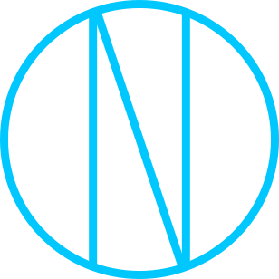

<h1 align="center">NAHO's Official Logo</h1>

<p align="center">
  <a href="https://github.com/trueNAHO/logo/stargazers"
    ></a>
  <a href="https://github.com/trueNAHO/logo/issues"
    ></a>
  <a href="https://github.com/trueNAHO/logo/contributors"
    ></a>
</p>

<p align="center">
  
</p>

<!--toc:start-->
- [Installation](#installation)
- [Usage](#usage)
- [Related](#related)
- [Contributing](#contributing)
- [License](#license)
<!--toc:end-->

## Installation

Download the logo in various resolutions with various background colors from the
[Releases](https://github.com/trueNAHO/logo/releases) page.

### SVG

The SVG file is named:

- `naho_logo.svg`

### JPG or PNG

Choose from a variety of optimized JPG and PNG files in various background color
and dimension combinations. The files are generated by permutating all
variables:

```bash
naho_logo_<background_color>_<width>x<height>.<extension>
```

| Variable                | Possible Values                                                                                                                                         |
|-------------------------|---------------------------------------------------------------------------------------------------------------------------------------------------------|
| `<background_color>`    | aqua, black, blue, fuchsia, gray, green, lime, maroon, navy, olive, purple, red, silver, teal, transparent, white, yellow                               |
| `<width>` or `<height>` | 32, 64, 128, 144, 240, 256, 360, 426, 480, 512, 640, 720, 854, 1024, 1080, 1280, 1440, 1920, 2048, 2160, 2560, 2880, 3840, 4096, 4320, 5120, 7680, 8192 |
| `<extension>`           | JPG, PNG                                                                                                                                                |

Note: A transparent JPG file is not generated as it defaults to a black
background color.

## Usage

### Requirements

- [`jpegoptim`](https://github.com/tjko/jpegoptim)
- [`optipng`](https://optipng.sourceforge.net)
- [`parallel`](https://www.gnu.org/software/parallel)

### Build

To build the images, run:

```bash
make
```

## Related

- [GNU Parallel](https://www.gnu.org/software/parallel)
  - Execute jobs in parallel using one or more computers.
- [OptiPNG](https://optipng.sourceforge.net)
  - PNG optimizer that recompresses image files to a smaller size, without
    losing any information.
- [jpegoptim](https://github.com/tjko/jpegoptim)
  - Utility to optimize JPEG files.

## Contributing

For information on contributing to this project, please refer to
[CONTRIBUTING.md](docs/CONTRIBUTING.md).

## License

This project is licensed under [MIT](LICENSE).
